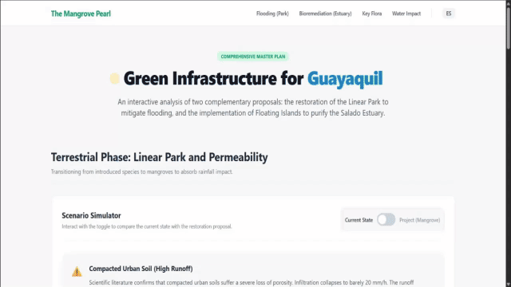

# SpaceHack-Mangroves
Evento: Spacehack 2026 (Concurso Académico) | Periodo: 2026-Ex1 | Estado: Completado

## Equipo de trabajo
- Josue Alvarez (Sin cuenta de GitHub)
- María Crespín (Sin cuenta de GitHub)
- David Motoche ([GdavidM](https://github.com/GdavidM))
- Domenica Parrales (Sin cuenta de GitHub)
- José Viteri ([jvit04](https://github.com/jvit04))

## Capturas / Demo


## Funcionalidad
- [ ] **Simulador interactivo de escorrentía terrestre:** Permite conmutar escenarios en tiempo real para visualizar analíticamente el impacto del suelo urbano compactado frente al efecto esponja de la restauración con manglar. [Commit](https://github.com/jvit04/Proyecto_SpaceHack_Mangroves/commit/6bb366e0fa534ac33df925ae54c61ad657a62a12)
- [ ] **Desglose dinámico de la composición vegetal:** Gráfico interactivo tipo Dona que expone las proporciones entre especies introducidas, flora nativa y manglares dentro del Parque Lineal. [Commit](https://github.com/jvit04/Proyecto_SpaceHack_Mangroves/commit/6bb366e0fa534ac33df925ae54c61ad657a62a12)
- [ ] **Modelo de simulación de picos de inundación:** Curva de área/línea interactiva que proyecta el comportamiento del nivel superficial del agua acumulada durante un evento crítico de 6 horas acoplando precipitaciones torrenciales y pleamar. [Commit](https://github.com/jvit04/Proyecto_SpaceHack_Mangroves/commit/6bb366e0fa534ac33df925ae54c61ad657a62a12)
- [ ] **Diagrama estructural interactivo de biorremediación:** Modelo por capas en HTML/CSS que detalla la anatomía de una isla flotante (vegetación emergente, matriz de PVC/bambú y red de raíces purificadoras). [Commit](https://github.com/jvit04/Proyecto_SpaceHack_Mangroves/commit/6bb366e0fa534ac33df925ae54c61ad657a62a12)
- [ ] **Proyección a largo plazo del impacto hídrico:** Gráfico de doble eje que mapea la correlación inversa entre el incremento del Oxígeno Disuelto (OD) y la reducción de la Demanda Bioquímica de Oxígeno (DBO) en un horizonte de 5 años. [Commit](https://github.com/jvit04/Proyecto_SpaceHack_Mangroves/commit/6bb366e0fa534ac33df925ae54c61ad657a62a12)

## Tecnologías
`HTML5` `Tailwind CSS` `JavaScript` `Chart.js` `Git`

## Ejecución
### Instrucciones paso a paso

#### Opción 1: Despliegue rápido para usuarios generales (Sin Consola)
1. Descargue el proyecto completo presionando el botón **Code** (en la parte superior derecha de esta página) y seleccionando **Download ZIP**.
2. Descomprima el archivo `.zip` descargado en su computadora.
3. Abra la carpeta extraída, busque el archivo llamado `proyectoCompleto.html` y haga **doble clic** sobre él. Se abrirá automáticamente el simulador interactivo en su navegador web (Chrome, Edge, Safari, etc.) sin necesidad de configuraciones adicionales.

#### Opción 2: Despliegue técnico (Vía Terminal)
1. Clonar el repositorio remoto en su máquina local:
```bash
    git clone [https://github.com/jvit04/Proyecto_SpaceHack_Mangroves.git](https://github.com/jvit04/Proyecto_SpaceHack_Mangroves.git)
    cd Proyecto_SpaceHack_Mangroves
```
2. Ejecutar y renderizar el entorno completo unificado localmente en el navegador predeterminado:
```bash
    open proyectoCompleto.html
```
    *(En Windows, puede usar el comando `start proyectoCompleto.html` o simplemente abrir el archivo desde el explorador).*

## Métricas de Progreso
| Indicador             | Valor      |
|-----------------------|------------|
| Commits totales       | 7          |
| Issues/PRs fusionados | 0          |
| Cobertura de pruebas  | N/A        |
| Última actualización  | 2026-03-28 |

## Reflexión y Aprendizajes
- **Habilidades desarrolladas:** Comprensión e integración de dinámicas hidráulicas y ecológicas costeras dentro de interfaces de software interactivas, así como modelado de datos temporales mediante abstracciones visuales eficaces en el frontend.
- **Qué funcionó bien:** La unificación de las fases terrestre y acuática dentro de una misma interfaz fluida (`proyectoCompleto.html`), prescindiendo de dependencias pesadas u objetos SVG complejos gracias al uso nativo de componentes estilizados en Tailwind y renderizado directo sobre canvas.
- **Qué se podría mejorar:** Integrar un pipeline de automatización o ingesta directa de datos de sensores en tiempo real (IoT) para sustituir las curvas estáticas simuladas del Estero por métricas hidrológicas vivas.
- **Conceptos clave aplicados del evento:** Biorremediación urbana estuarina, infraestructura verde adaptativa, coeficientes de infiltración en suelos compactados y mitigación biológica de inundaciones a través de la reintroducción de *Rhizophora mangle*.